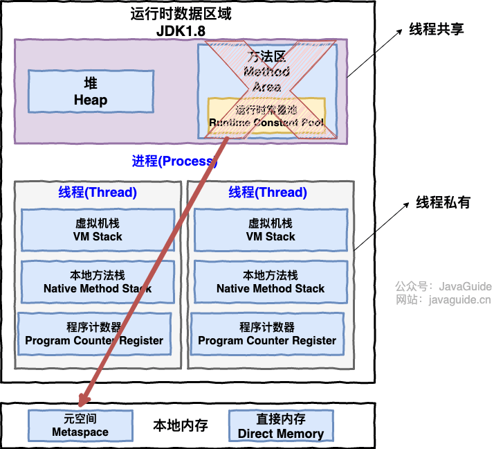
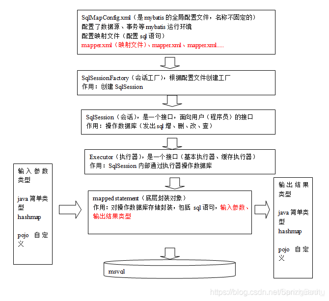
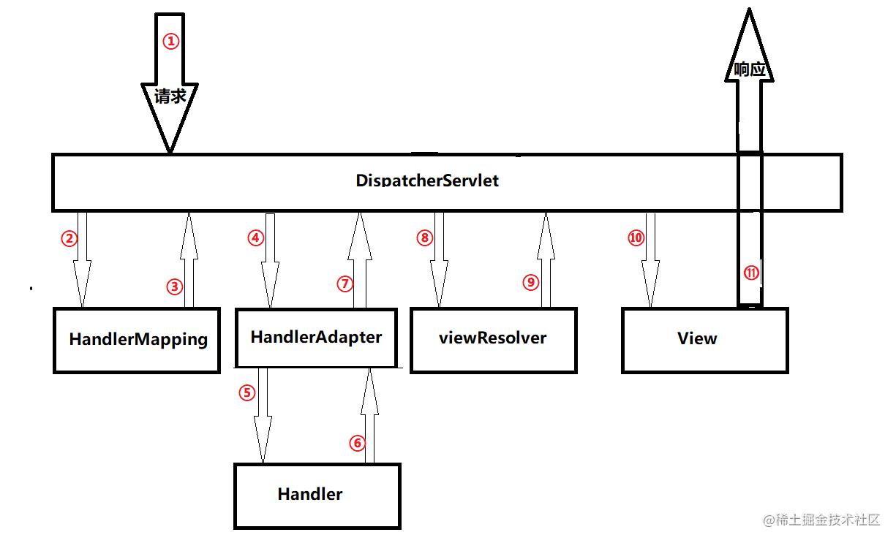
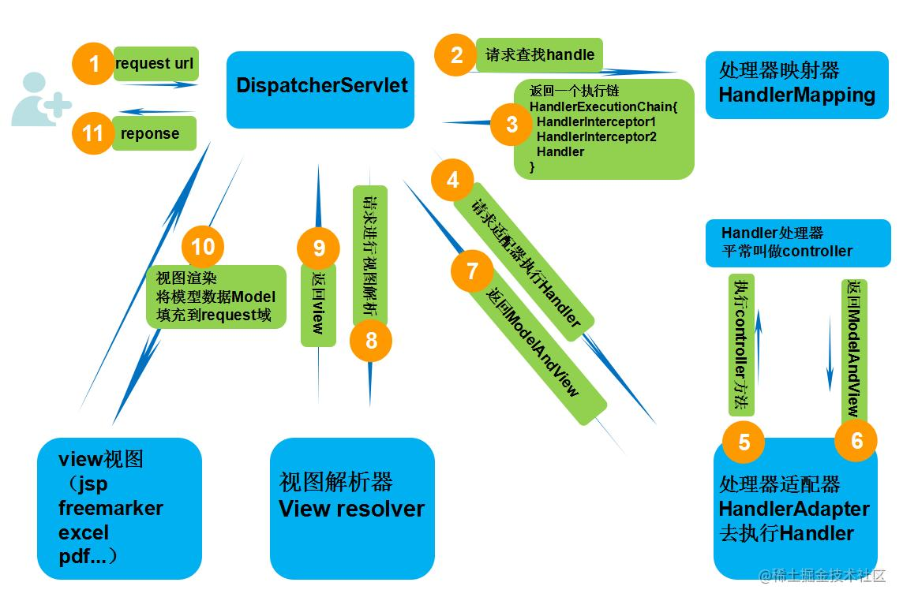

# 面试针对性突击问题

## Java基础

#### 0.什么是面向对象

面向对象是一种以“对象”为中心的编程思想，把要解决的问题分解成各个对象，建立对象的目的不是为了完成一个步骤，而是为了描叙某个对象在整个解决问题的步骤中的属性和行为。

面向对象的程序设计把计算机程序视为一组对象的集合，每个对象都可以接收其他对象发过来的消息，并处理这些消息，计算机程序的执行就是一系列消息在各个对象之间传递。

面向对象编程的三大特性是：封装、继承和多态。

#### 1.java == 和 equals的区别

在Java中，对于基本数据类型，==判断的是值，对于引用类型，判断的是他们是否指向的同一个地址

> 如果两个对象的引用相同,那么他们的hash码也一定相同,但是hash码相同,两个引用不一定相同

而equals用于比较对象的内容是否相等。equals()方法存在于object类中,所以所有类都有该方法
他的使用分两种情况

> 类没有重写equals()方法,等价于通过"=="比较两个对象;
> 类重写了该方法,一般重写是用来比较两个对象的属性是否相同

#### 2.Java实例化对象的方式有哪些

通过构造器创建对象,如new一个
通过反射创建对象,如spring的注入
通过克隆创建对象


#### 3.浅拷贝与深拷贝的区别

浅拷贝和深拷贝是两种不同的对象复制方式。浅拷贝是指创建一个新对象，这个对象有着原始对象属性值的一份精确拷贝。如果属性是基本类型，拷贝的就是基本类型的值；如果属性是引用类型，拷贝的就是内存地址，因此如果其中一个对象改变了这个地址，就会影响到另一个对象。深拷贝是指创建一个新对象，这个对象有着原始对象属性值的一份精确拷贝，并且拷贝的对象的所有引用类型的属性也会被递归复制。

#### 4.抽象类和接口的区别

实现: 抽象类的子类使用extends来继承; 接口使用implements来实现
构造函数:抽象类可以有构造函数;接口不能有
实现数量:类只能继承一个抽象类;可以实现多个接口
访问修饰符:抽象类中的方法可以是任意访问修饰符;接口默认是public修饰

#### 5.StringBuilder和StringBuffer的区别

StringBuilder和StringBuffer都继承了AbstractStringBuilder类，都是用char数组存储字符串，都可以动态修改字符串内容。

区别：

> 1.StringBuilder的方法没有加上synchronized关键字,线程是不安全,但性能更高;StringBuffer的方法都加了synchronized关键字,所以线程是安全的,但性能较低.
> 2.StringBuffer有一个toStringCache字段,用来缓存最近一次调用toString()方法的结果,可以一定程度上避免开销.


## 反射机制

#### 1.什么是反射?

Java的反射机制是在运行状态中,对于任意一个类,都能知道这个类的所有属性和方法;对于任意一个对象都能够调用它的任意方法和属性;这种动态获取信息和动态调用对象方法的功能就称为Java语言的反射机制.

#### 2.Java 反射机制主要提供的功能

在运行时判断任意一个对象所属的类。
在运行时构造任意一个类的对象。
在运行时判断任意一个类所具有的成员变量和方法。
在运行时调用任意一个对象的方法。
生成动态代理。

#### 3.获取class对象的方式

1. ```java
   Class alunbarClass = TargetObject.class;
   ```

2. ```java
   Class alunbarClass1 = Class.forName("cn.javaguide.TargetObject");	
   ```

3. ```java
   TargetObject o = new TargetObject();
   Class alunbarClass2 = o.getClass();
   ```

## 数据结构

Colletion

> List
>
> > ArrayList	`Object[]` 数组
> > Vector	`Object[]` 数组
> > LinkedList	双向链表
>
> Set
>
> > HashSet	基于 `HashMap` 实现的，底层采用 `HashMap` 来保存元素
> > LinkedHashSet 是 `HashSet` 的子类，并且其内部是通过 `LinkedHashMap` 来实现的
> > TreeSet	红黑树(自平衡的排序二叉树)
>
> Queue
>
> > PriorityQueue `Object[]` 数组来实现二叉堆
> > ArrayQueue `Object[]` 数组 + 双指针
> > ArrayDeque 双端队列

Map

> HashMap
> LinkedHashMap
> Hashtable	数组+链表组成的，数组是 `Hashtable` 的主体，链表则是主要为了解决哈希冲突而存在的
> TreeMap	红黑树

#### 1.linkedlist和arraylist的区别

> **线程安全**: 都是不同步的,也就是不保证线程的安全
> **底层数据结构**: linkedlist是双向链表,而Arraylist底层是Object数组实现的
> **快速随机访问:** Linkedlist不支持快速高效的随机访问,而Arraylist因为实现了RandomAccess接口支持
> **内存空间占用**: Linkedlist的空间花费主要体现在他每一个元素都要比Arraylist更多,因为需要(前驱以及后继的数据);arraylist则空间花费主要表现在list列表尾部会预留一部分空间

#### 2.hashmap的底层原理，扩容过程

在Java1.8之后, hashmap底层是由数组加链表或者红黑树实现;当链表长度超过8时链表会转化为红黑树,不过在此之前会判断数组长度是否超过大于等于64;如果没有,则会先进行扩容操作;当元素数量超过数组长度与负载因子乘积时也会进行数组的扩容操作,扩容后会重新计算hash值取模分配到新的数组中.

#### 3.hashmap扩容线程不安全在哪，怎么解决

在扩容过程中,多个线程可能同时对一个链表进行操作;可以使用线程安全的类,比如concurrenthashmap或者在创建hashmap时通过预估容量和负载因子来初始化hashmap,减少扩容次数.

#### 4.hashmap如何遍历

主要有三种方式

1.使用iterator迭代器进行遍历
2.使用foreach循环遍历所有

> 一种是用 Map.Entry<>, 一种用 keySet() valueSet()

3.使用lambda表达式进行遍历


## 多线程

#### 1.线程与进程

进程是程序的一次执行过程，是系统运行的基本单位；系统运行一个程序，既是进程的创建、运行到消亡的过程。
线程与进程相似，是比进程更小的一个执行单位，一个进程在执行过程中可以产生多个线程，与进程不同的是同类的多个线程共享进程的堆和方法区资源，但每个线程有自己的程序计数器、虚拟机栈和本地方法栈。

#### 进程间的通信方式#


#### 2.并发与并行的区别

- **并发**：两个及两个以上的作业在同一 **时间段** 内执行。
- **并行**：两个及两个以上的作业在同一 **时刻** 执行。

最关键的点是：是否是 **同时** 执行。

#### 2.怎么创建一个线程，怎么获取一个线程的名字。有哪些线程池？

> 1.继承Thread类,重写run方法,然后创建线程对象并调用start方法
> 2.实现Runnable接口或者Callable接口并实现run方法,将其作为参数提交给Thread类的构造器
> 3.使用线程池或Executor框架来管理和执行多个线程


#### 为什么要使用多线程


#### 如何保证线程安全#

线程安全指的是多线程环境下，保证程序的正确性、效率和一致性；可以使用：

> 1.使用线程安全的类(Vector)
> 2.使用synchronized同步代码块,或使用Lock锁
> 3.使用volatile关键字
> 4.使用原子类

#### 并发关键字synchronized与volatile


#### Lock


#### 3.ThreadLocal介绍一下，它的key是什么

通常情况下我们创建的变量可以被任意的线程所修改,ThreadLocal可以实现每一个线程拥有自己的专属本地变量;如果创建了一个ThreadLocal的变量,那么访问这个变量的每个线程都会有这个变量的本地副本

#### 4.什么是线程安全 


#### 5.如何实现线程安全,线程同步工具有哪些


#### 6.ArrayList线程安全问题？如何解决


#### 7.有多个线程，需要线程一个一个执行完之后才能做下一步的动作，怎么实现？

1.使用Thread类的join()方法,让当前线程等待指定线程执行完毕后再继续执行。

2.使用CountDownLatch类，创建一个倒数计时器，让每个线程在执行完任务后调用countDown()方法，主线程在await()方法等待所有线程完成。

#### 如何创建线程池

**方式一：通过`ThreadPoolExecutor`构造函数来创建（推荐）**


#### 读写锁是什么#

读写锁也叫多读者单写者锁，是计算机程序并发控制的一种同步机制，读操作可并发重入，写操作是互斥的。

> **Java实现**
>
> 实现ReadWriteLock接口	
>
> 或者使用ReentrantReadWriteLock实现类
>
> 实现原理
>
> > 在AQS中通过int类型的全局变量state来表示同步状态,但是ReentrantReadWriteLock有两把锁,所以用高16位表示读锁,低16位表示写锁


## java虚拟机



#### 1.jvm有哪些区，各自什么作用

线程共享：堆区，方法区
线程私有的：虚拟机栈，本地方法栈，程序计数器

**堆区： **是Java虚拟机中内存最大的一块，是所有线程共享的一块区域，在虚拟机启动时创建。此内存区域的唯一目的就是存放对象实例，几乎所有的对象实例以及数组都在这里分配内存(方法中的对象引用没被返回,或者未被外面使用直接在栈上分配)。

**方法区:** 当虚拟机要使用一个类时，它需要读取并解析 Class 文件获取相关信息，再将信息存入到方法区。方法区会存储已被虚拟机加载的 **类信息、字段信息、方法信息、常量、静态变量、即时编译器编译后的代码缓存等数据**。

**虚拟机栈:** 它的生命周期和线程相同，随着线程的创建而创建，随着线程的死亡而死亡。
除了一些 Native 方法调用是通过本地方法栈实现的，其他所有的 Java 方法调用都是通过栈来实现的.
方法调用的数据需要通过栈进行传递，每一次方法调用都会有一个对应的栈帧被压入栈中，每一个方法调用结束后，都会有一个栈帧被弹出。
栈由一个个栈帧组成，而每个栈帧中都拥有：局部变量表、操作数栈、动态链接、方法返回地址。和数据结构上的栈类似，两者都是先进后出的数据结构，只支持出栈和入栈两种操作。

**程序计数器:** 
字节码解释器通过改变程序计数器来依次读取指令，从而实现代码的流程控制，如：顺序执行、选择、循环、异常处理。
在多线程的情况下，程序计数器用于记录当前线程执行的位置，从而当线程被切换回来的时候能够知道该线程上次运行到哪儿了。

#### 2.对堆和栈的理解#


#### 3.JVM的内存机制#


#### 4.jvm有哪些垃圾回收算法


---

## MySql

#### 1.数据库三范式#

数据库三范式是指在关系型数据库中为了消除数据冗余设计出的一系列规范。一般进行数据库设计时，应遵循三范式

> 第一范式确保表中每列的原子性,也就是不可拆分,(如地址可拆分成国家省市县,便不符合)
> 第二范式要求确保表中每列与主键相关,而不是只与主键的某部分相关(主要针对联合主键)
> 第三范式确保主键列之间没有传递函数依赖关系,也就是消除传递依赖
>
> [Mysql - 什么是三大范式（通俗详解） - 知乎 (zhihu.com)](https://zhuanlan.zhihu.com/p/590135927)


#### 2.数据库索引是什么

索引是对数据库表中一列或多列的值进行排序的一种结构，使用索引可快速访问数据库表中的特定信息。索引可以提高数据库的查询效率，减少数据库的查询时间，提高数据的完整性和准确性。

#### 3.创建数据库索引

> 1.创建表时直接创建索引
>
> > ```mysql
> > CREATE TABLE table_name (
> >     column1 datatype,
> >     column2 datatype,
> >     column3 datatype,
> >     ...
> >     INDEX index_name (column1, column2, ...),
> >     ...
> > );
> > ```

> 2.使用ALTER TABLE语句来直接创建索引
>
> > ```mysql
> > ALTER TABLE table_name ADD INDEX index_name (column1, column2, ...);
> > ```
>
> 3.使用CREATE INDEX语句对表增加普通索引或UNIQUE索引(唯一索引的列值不能重复)
>
> > CREATE [UNIQUE] INDEX index_name ON table_name (column1, column2, ...);

#### 4.索引失效#

常见的索引失效

>1.对列进行计算或者使用函数时，该列的索引会失效。
>2.不匹配数据类型，会造成索引失效。
>3.where语句中使用了IS NULL或者IS NOT NULL，会造成索引失效。
>4.当查询条件存在隐式转换时，索引会失效。
>5.如果条件中有or，即使其中有部分条件带索引也不会使用，除非将or条件中的每个列都加上索引。
>6.对于范围查询，如果索引列不是范围查询的第一列，那么索引也会失效。
>7.如果查询中使用了not，那么索引也会失效。


#### 1.MySQL查询执行过程


#### 1.如果MySQL有一个慢查询，该怎么去排查？


#### 2.如何检查语句是否走了索引？（explain）需要关注哪几个字段？


#### 3.如果走了索引，也进行了分页，还有什么可能导致慢查询？


#### drop、delete 与 truncate 区别？

`drop`(丢弃数据): `drop table 表名` ，直接将表都删除掉，在删除表的时候使用。

`truncate` (清空数据) : `truncate table 表名` ，只删除表中的数据，再插入数据的时候自增长 id 又从 1 开始，在清空表中数据的时候使用。

`delete`（删除数据） : `delete from 表名 where 列名=值`，删除某一行的数据，如果不加 `where` 子句和`truncate table 表名`作用类似。


#### 4.mysql事务的特性(ACID)？mysql四种隔离机制？各自的问题？#

##### 四大特性

> **Atomic**，原子性，事务的所有SQL操作作为原子工作单元执行，要么全部执行，要么全部不执行；**Consistent**，一致性，事务完成后，所有数据的状态都是一致的，即A账户只要减去了100，B账户则必定加上了100；
> **Isolation**，隔离性，如果有多个事务并发执行，每个事务作出的修改必须与其他事务隔离；**Duration**，持久性，即事务完成后，对数据库数据的修改被持久化存储。

##### 脏读、不可重复读和幻读

是数据库中由于并发访问导致的数据读取问题。
1.脏读是指一个事务读取了另一个事务未提交的数据，
2.不可重复读是指在一个事务的两次查询之中数据不一致，
3.幻读是指在一个事务的两次查询之中数据行数不一致。

##### 四种隔离级别

| 隔离级别                   | 脏读   | 不可重复读 | 幻读   |
| -------------------------- | ------ | ---------- | ------ |
| 读未提交(Read uncommitted) | 可能   | 可能       | 可能   |
| 读已提交(Read committed)   | 不可能 | 可能       | 可能   |
| 可重复读(Repeatable read)  | 不可能 | 不可能     | 可能   |
| 可串行化(Serializable)     | 不可能 | 不可能     | 不可能 |

#### 怎么解决的脏读幻读#


#### 5. 1亿的数据表查询很慢，怎么优化

> 1.选择合适的索引避免全表扫描和区分度不高的索引
> 2.减少查询的列数和行数，只返回需要的数据
> 3.使用分页查询，避免一次返回过多的数据
> 4.使用分表或分区，将大表拆成小表


#### 6.数据库乐观锁，悲观锁的实现


#### 7.CRUD增删改查


> 


#### mysql 超时时间设置

闲置连接的超时时间由wait_timeout控制,默认8小时。


---

## 计算机网络

#### 1.TCP的三次握手和4次挥手#


#### 1.tcp握手两次是否可以，为什么要四次挥手?


#### 2.为什么握手不用四次？那挥手三次可以吗？


#### 3.tcp首部有哪些内容


#### 4.tcp的序列号为32位 超过32位所能表示的最大值该怎么办 (重新从0开始)


#### 5.如果tcp序列号为1的没发送成功重新发送了，然后网络带宽很大序列号到最大值后 又继续从0开始 发了个1 怎么判断这两个序列号1的顺序

时间戳

#### 6.输入url到网页显示的过程


#### 7.接上一个问题如果不是http请求是https该怎么办


#### 8.tcp是五元组，udp是几元组


#### 9.TCP 与 UDP 的区别


#### 10.HEAD和PUT在上传时的区别#

HEAD请求方法与GET请求方法类似，但是它只返回请求URL所对应的资源头部信息，而不返回实体的主体部分

PUT请求方法用于向服务器上传新的资源或更新已有的资源，通常需要客户端提供完整的资源内容，因此可用于上传文件等大量数据。PUT方法会修改服务器上的资源，是一种不安全的请求。

#### 一个请求很慢，怎么排查这个问题

一般会从以下几个方面入手：
1.是不是资源层面的瓶颈，硬件、配置环境之类的问题
2.针对查询类接口，是不是没有添加缓存，如果加了，是不是热点数据导致负载不均衡
3.是不是有依赖于第三方接口，导致因第三方请求拖慢了本地请求
4.是不是接口涉及业务太多，导致程序执行跑很久
5.是不是sql层面的问题导致的数据等待加长，进而拖慢接口
6.网络层面的原因？带宽不足？DNS解析慢
7.确实是代码质量差导致的，如出现内存泄漏，重复循环读取之类


---

## 设计模式#

#### 单例模式


#### 工厂模式


#### 抽象工厂模式


---

## 框架部分

### MyBatis

#### 1.什么是Mybatis

MyBatis 是一个可以自定义 SQL、存储过程和高级映射的持久层框架。MyBatis 避免了几乎所有的 JDBC代码和手动设置参数以及获取结果集。

我们在使用了 MyBatis 之后，只需要提供 SQL 语句就好了，其余的诸如：建立连接、操作 Statment、ResultSet，处理 JDBC 相关异常等等都可以交给 MyBatis 去处理，我们的关注点于是可以就此集中在 SQL 语句上，关注在增删改查这些操作层面上。



#### 2.Mybatis的缓存#

Mybatis对缓存提供支持，一级缓存是默认使用的，二级缓存需要手动开启。

##### 区别:

> 一级缓存的作用域是一个sqlsession内；
> 二级缓存作用域是针对mapper进行缓存；

##### 一级缓存:

​	在参数和SQL完全一样的情况下，我们使用同一个SqlSession对象调用一个Mapper方法，往往只执行一次SQL，因为使用SelSession第一次查询后，MyBatis会将其放在缓存中，以后再查询的时候，如果没有声明需要刷新，并且缓存没有超时的情况下，SqlSession都会取出当前缓存的数据，而不会再次发送SQL到数据库。
​	一级缓存时执行commit，close，增删改等操作，就会清空当前的一级缓存；当对SqlSession执行更新操作（update、delete、insert）后并执行commit时，不仅清空其自身的一级缓存（执行更新操作的效果），也清空二级缓存（执行commit()的效果）。

##### 开启二级缓存

> xml配置中开启
>
> 注解开启

#### 3.  # {}与$ {}的区别

##### 关于#{}

> #{}表示一个占位符号,相当于jdbc中的一个?
> #实现的是向prepareStatement中的预处理语句中设置参数值
> where id= #{user_id}  	解析为 	where id="11"

##### 关于${}

> ${}将传入的数据直接显示生成在sql中
> ${value},value只能写对应的值,不能随便写,因为${}不会自动进行jdbc类型转换
> 在jabc不支持使用占位符的地方都可以用${}

##### 区别

> #号能防止sql注入,$不能够防止
> 在jdbc中能使用占位符的地方尽量使用#{},不支持的地方只能使用${},如动态参数
>
> > 1.动态指定表明
> > 2.排序时使用OrderBy动态参数时

### Spring

#### 1.Spring如何实现自动装配


#### 2.Spring事务管理


#### 3.spring中常用注解？AOP的一些注解呢？

- @Autowired：自动装配，可以对类成员变量、方法及构造函数进行标注，完成自动装配的工作。
- @Resource：JSR-250提供的注解，可以对类成员变量、方法及构造函数进行标注，完成自动装配的工作。
- @Component：通用的注解，可标注任意类为Spring组件。
- @Repository：标注数据访问组件，即DAO组件。
- @Service：标注服务层组件。
- @Controller：标注表现层组件。
- @Configuration：标注配置类，相当于Spring的XML配置文件。
- @Bean：标注在方法上，用于声明当前方法的返回值是一个Bean对象，等价于XML中的<bean>。
- @Value：属性注入。
- @Qualifier：当有多个实现类时，可以用@Qualifier指定注入哪个实现类的实例。
- @Scope：指定Bean的作用域，包括singleton、prototype、request、session和global session等。
- @PostConstruct：指定初始化方法。
- @PreDestroy：指定销毁方法。

**aop的注解**

> Spring支持AspectJ的注解式切面编程。
> >@Aspect 声明一个切面
> >@After 在方法执行之后执行（方法上）
> >@Before 在方法执行之前执行（方法上）
> >@Around 在方法执行之前与之后执行（方法上）
> >@PointCut 声明切点

|      |                 |      |
| ---- | --------------- | ---- |
|      | @Controller     |      |
|      | @RequestMapping |      |
|      |                 |      |


#### 4.@Controller和@Service注解可以互换吗？为什么不能呢？


#### 5.spring bean的注册有哪些方式？


#### 5.1Spring Bean的作用域

>**singleton**：这是Spring的默认作用域，也就是为每个IOC容器创建唯一一个Bean实例，也称为单例。
>**prototype**：针对每个getBean请求，容器会单独创建一个Bean实例。
>**request**：在Web应用程序中，为每个HTTP请求创建一个Bean实例。
>**session**：在Web应用程序中，为每个HTTP会话创建一个Bean实例。
>**global session**：在Web应用程序中，为每个全局HTTP会话创建一个Bean实例。

#### 6.介绍一下IOC，有什么优势


#### 7.spring boot怎么实现AOP


#### 


#### 8.spring context和bean factory的关系是什么？


#### 9.Spring bean 是不是线程安全的

Spring 获取实例的时候默认单例模式，只有一个实例实例化之后向整个系统提供这个实例，这是多线程并发需要注意的地方。
多个线程并访请求对应的业务逻辑（成员方法的时候）,对该单例的成员属性进行修改，要考虑线性同步问题。
同步机制的比较
ThreadLocal 以时间换空间 每个线程独立的变量副本隔离了多个线程对数据的访问冲突。
线程同步机制以时间换空间线程排队访问。

#### 

#### 12.spring中循环依赖问题怎么解决


### Spring MVC

#### 1.RESTful 风格

> GET 请求对应查询接口，查询
> POST 请求对应新增接口，插入
> PUT 请求对应修改接口，更新
> DELETE 请求对应删除接口等等

#### 2.Spring MVC的主要组件？

1）**前端控制器 DispatcherServlet**（不需要程序员开发）
	作用：接收请求、响应结果，相当于转发器，有了DispatcherServlet 就减少了其它组件之间的耦合度。
2）**处理器映射器HandlerMapping**（不需要程序员开发）
	作用：根据请求的URL来查找Handler
3）处理器适配器HandlerAdapter
	注意：在编写Handler的时候要按照HandlerAdapter要求的规则去编写，这样适配器HandlerAdapter才可以正确的去执行Handler。
4）处理器Handler（需要程序员开发）
5）视图解析器 ViewResolver（不需要程序员开发）
	作用：进行视图的解析，根据视图逻辑名解析成真正的视图（view）
6）视图View（需要程序员开发jsp）
	View是一个接口， 它的实现类支持不同的视图类型（jsp，freemarker，pdf等等）

#### 3.请描述Spring MVC的工作流程？

​	1、用户发送请求至前端控制器DispatcherServlet。
​	2、 DispatcherServlet收到请求调用HandlerMapping处理器映射器。
​	3、 处理器映射器找到具体的处理器(可以根据xml配置、注解进行查找)，生成处理器对象及处理器拦截器(如果有则生成)一并返回给DispatcherServlet。
​	4、DispatcherServlet调用HandlerAdapter处理器适配器。
​	5、 HandlerAdapter经过适配调用具体的处理器(Controller，也叫后端控制器)。
​	6、Controller执行完成返回ModelAndView。
​	7、 HandlerAdapter将controller执行结果ModelAndView返回给DispatcherServlet。
​	8、  DispatcherServlet将ModelAndView传给ViewReslover视图解析器。
​	9、  ViewReslover解析后返回具体View，这个view不是完整的，仅仅是一个页面（视图）名字，且没有后缀名。
​	10、DispatcherServlet根据View进行渲染视图（即将模型数据填充至视图中）。
​	11、 DispatcherServlet响应用户。





#### 10.spring mvc是怎么从url解析到具体的方法的？


### Spring Boot

#### Spring Boot的优势主要有以下几点：

- 快速构建独立的Spring应用
- 内嵌web服务器
- 自动starter依赖，简化构建配置
- 自动配置Spring以及第三方功能
- 提供生产级别的监控、健康检查以及外部优化配置
- 无代码生成、无需编写XML


### Mybatis-Plus

#### 


---

## Redis基础

#### 1.Redis为什么是单线程？Redis单线程的优势有哪些


#### 2.Redis的数据结构你了解吗？他的数据结构的底层实现原理讲一讲


#### 3.Redis分布式锁的实现

分布式锁：满足分布式系统或多集群模式下多进程可见并互斥的锁

核心思想就是让大家都使用同一把锁


实现机制：使用Redis的setnx方法，再添加过期时间防止死锁，此方法可以保证加锁和设置过期时间具有原子性。
误删锁：当线程阻塞时，可能存在误删锁的可能，
	解决：使用lua脚本，将锁的判断与删除作为原子操作同时执行

#### 4.缓存更新策略

|              | 内存淘汰                                                     | 超时剔除                                                     | 主动更新                                 |
| ------------ | ------------------------------------------------------------ | ------------------------------------------------------------ | ---------------------------------------- |
| **说明**     | 不用自己维护,当Redis内存不足时自动淘汰部分数据。下次查询时更新数据。 | 给缓存数据添加ttl时间，到期后自动删除缓存。下次查询时更新缓存。 | 编写业务逻辑，在修改数据库的同时主动更新 |
| **一致性**   | 差                                                           | 一般                                                         | 好                                       |
| **维护成本** | 无                                                           | 低                                                           | 高                                       |

其中主动更新策略，先操作数据库，再删除缓存，可以有效缓解数据库读写不一致问题


#### 5.什么是缓存穿透?怎么解决

缓存穿透是指客户端请求的数据在缓存中和数据库中都不存在，这样缓存永远都不会生效，这些请求会一直打到数据库上，造成数据库压力过大。


| 解决方法 | 布隆过滤                                                     | 缓存空对象                                                   |
| -------- | ------------------------------------------------------------ | ------------------------------------------------------------ |
| 说明     | 采用哈希思想解决的问题，通过一个庞大的二进制数组去判断当前数据是否存在，存在则放行，不存在则直接返回 | 当客户端访问不存在的数据时，先请求redis，不存在，再请求数据库，但是数据库不存在，请求直击数据库。当遇到大量这样的请求时，会导致数据库压力过大，此时则选择将空数据返回到redis中。 |
| 特点     | 节约空间，但是存在误判的可能，因为采取的是哈希思想           | 内存占用大                                                   |


#### 6.介绍一下缓存血崩？怎么避免

缓存雪崩是指在同一时段大量的缓存key同时失效或者Redis宕机，导致大量的请求打到数据库，带来巨大压力。

> 方案：
>
> 1.给不同key的ttl添加随机值
>
> 2.利用redis集群提高服务的可用性
>
> 3.给缓存业务添加降级限流策略
>
> 4.添加多级缓存

#### 7.什么是缓存击穿?怎么解决

缓存击穿问题也叫热点key问题，就是当一个被高并发访问的热点key突然失效了，无数的请求访问会在瞬间给数据库带来巨大的冲击。

例如：当线程一在查询缓存时，缓存失效，本来应当去查询数据库将数据重新加载到缓存，此时只要线程一正常走完流程其他线程便能在缓存中查询到数据；但是热点key可能在线程一还没有更新缓存时，其他线程边大量的去缓存中查询数据库而导致数据库压力过大

| 解决方案 | 互斥锁                                                       | 逻辑过期                                                     |
| -------- | ------------------------------------------------------------ | ------------------------------------------------------------ |
| **说明** | 因为互斥锁的性能，当线程查询数据库时，尝试获取互斥锁，获取成功后其他线程不能再获取，再等待一段时间后重新查询 | 即手动在Redis中添加热点数据，设置永不过期 ，再在该数据外部封装一层过期时间，当客户端查询缓存得到数据时，判断是否逻辑过期，若已经过期则获取互斥锁，查询数据更新缓存，其他线程则直接返回过期数据。 |
| 优点     | 1. 没有额外的内存消耗 2.实现简单 3.保证一致性                | 线程无需等待                                                 |
| 缺点     | 1. 线程需要等待，性能受到影响 2.有死锁风险                   | 1.不保证一致性 2.有额外的内存消耗 3.实现更复杂               |


#### 1.怎么解决的超卖问题

乐观锁：修改数据库时判断数据库库存余量是否大于0

redis原子操作：提前将数据预存至Redis中，用Java调用lua脚本将获取库存，判断是否充足以及减少库存作为原子操作执行

#### 2.redis在这里的作用是什么，少卖问题怎么产生的？

少卖问题是因为，生成订单后，因为订单超时等原因导致的订单失效，导致交易失败，而库存却已经扣减；解决方法是，在订单失效后让库存+1；

#### 3.如何实现的异步秒杀操作

秒杀业务的流程为，从redis中判断库存是否充足，充足创建订单，返回订单给用户；
同时将订单放到队列中让另外的线程完成后续的数据库操作，此时可以大大降低数据库的压力


#### 有一个定时任务，执行时间非常长，你怎么排查并进行优化？


#### Redis如何保证缓存不丢失？（持久化机制）

1.**RDB机制**(快照)：RDB持久化是指在指定的时间间隔内将内存中的数据集以快照的方式写入磁盘，并保存到一个名为dump.rdb的二进制文件中，也是默认的持久化方式，它恢复时是将快照文件从磁盘直接读到内存里。

2.**AOF机制（增量的备份）:**AOF日志是持续增量的备份，将Redis执行过的每个写操作以日志的形式记录下来(读操作不记录)，只许追加文件但不可以改写文件。redis启动的时候会读取该文件进行数据恢复，根据日志文件的内容将写指令从前到后执行一次以完成数据的恢复工作。


#### RDB和AOF的对比各自的优点


#### Redis的大key问题怎么解决


#### redis集群有了解吗？主从了解吗？


#### 集群与分布式的区别与理解


#### Redis主从复制, 哨兵，集群的区别,以及怎么部署 都自己部署过吗？集群比其他好的点在哪?


#### 如果某一时刻集群全部宕机，可能会导致多少时间的数据丢失？


#### 死信队列有了解吗？


#### 说说令牌桶和漏桶算法


#### 分布式理论中，你是如何保证最终一致性的？


#### 限流的算法有哪些？负载均衡的算法有哪些？


---

## 其他

#### 敏捷模式的概念和优缺点

敏捷模式是一种软件开发方法，它强调快速响应需求变化，持续交付可用的软件产品，以及团队成员之间的紧密协作.


---

## hm点评项目

#### 1.后端生成token用redis代替session实现登录

业务流程

> 主要分为三步(1.发送验证码,2.短信验证码登录注册,3.校验登陆状态)
> 1.发送验证码
> 用户提交手机号后,校验手机号是否合法,如果合法则发送验证码,同时将验证码进行保存,再以短信的方式发送给用户;保存的时候用前缀加上手机号作为key,验证码作为value存入redis中.
> 2.短信验证码登录注册
> 用户将得到的验证码和手机号进行输入,后台从Redis中通过手机号比对拿到验证码和用户进行比较,如果相同后台根据用户手机号查询用户,不存在则创建用户保存到数据库,然后将用户信息保存到Redis中,方便后续获得登录信息,其中将用户的部分信息作为值，随机生成的token
> 3.


---